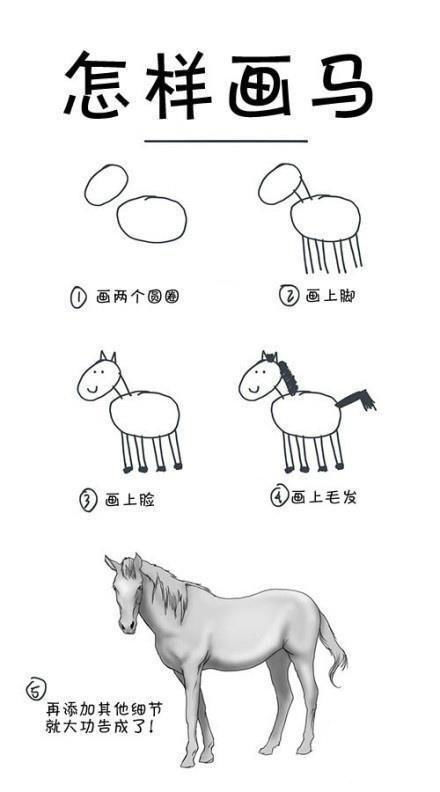

> 提交地址：[https://github.com/alibaba/lowcode-engine/issues](https://github.com/alibaba/lowcode-engine/issues)

### 提交前必读
由于引擎项目复杂，很多问题在复现和沟通上无法花费太多时间，需要大家尽力将复现步骤说明白。


**你以为的 issue**




**我们看到的 issue**

为了更好的进行协作，对引擎 issue 的处理定了一些处理的优先级。请大家认真阅读 Orz.

- 【支持快】通过线上 Demo 地址 + 控制台输入 API 可复现。
- 【支持快】通过线上 Demo + 导入 schema 可复现
- 【支持稍慢】通过线上 Demo + 完整操作步骤可复现
- 【支持稍慢】通过线上 Demo + 变更代码可复现，并清楚的说明变更代码的位置和内容
- 【支持慢】有完整的项目地址，下载下来可直接安装依赖并启动复现的
- 【支持慢】需求类型的由于人力有限，欢迎大家 PR，如能讲清楚背景上下文和场景，项目维护团队更容易给出方案建议或方向指引。
- 【不保证提供支持】其他
   - 只有标题没有复现步骤
   - 复现步骤不清晰
   - 和引擎无关的

### 不同优先级的示例
#### 【支持快】通过线上 Demo 地址 + 控制台输入 API 可复现。
**示例**

复现步骤：

- 打开线上 demo
- 在控制台输入
```json
// 当前 doc
const doc = window.AliLowCodeEngine.project.currentDocument

// 新建 doc 并成功切换
window.AliLowCodeEngine.project.openDocument({
    componentName: 'Page'
});

// 无法切换回来
window.AliLowCodeEngine.project.openDocument('docl4xkca5b')
```

预期效果：

- 使用 openDocument 可以正常的切换回原来的 doc

#### 【支持快】通过线上 demo + 导入 schema 可复现
步骤：

- 使用线上 demo
- 导入下面的 schema
- schema 代码/schema zip 压缩包
- 页面效果如下

期望：

- 页面中的 xxx 部分和预期不符合，期望的效果是 xxx

#### 【支持稍慢】通过线上 demo + 完整操作步骤可复现
**示例**
1.使用 antd 组件


2.拖拽这个组件


3.配置该属性值为 100


期望效果：

- 组件同配置一致

#### 【支持稍慢】通过线上 demo + 变更代码可复现，并清楚的说明变更代码的位置和内容
**示例**


#### 【支持慢】有完整的项目地址，下载下来可直接安装依赖并启动复现的
由于完整的项目中有很多冗余的信息，这部分排查起来十分耗时且困难。不推荐使用改方式。

#### 【不保证提供支持】其他
##### 只有标题没有复现步骤


##### 复现步骤不清晰


##### 和引擎无关的


### 扩展阅读
强烈推荐阅读 [《提问的智慧》](https://github.com/ryanhanwu/How-To-Ask-Questions-The-Smart-Way)、[《如何向开源社区提问题》](https://github.com/seajs/seajs/issues/545) 和 [《如何有效地报告 Bug》](http://www.chiark.greenend.org.uk/~sgtatham/bugs-cn.html)、[《如何向开源项目提交无法解答的问题》](https://zhuanlan.zhihu.com/p/25795393)，更好的问题更容易获得帮助。（此段参考 [antd](https://github.com/ant-design/ant-design)）
